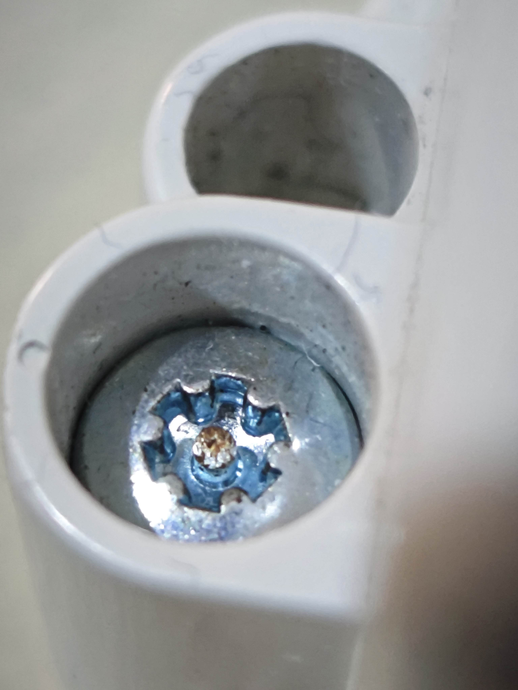
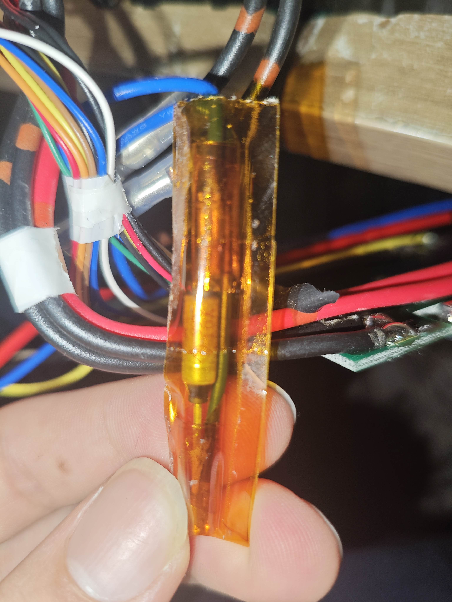
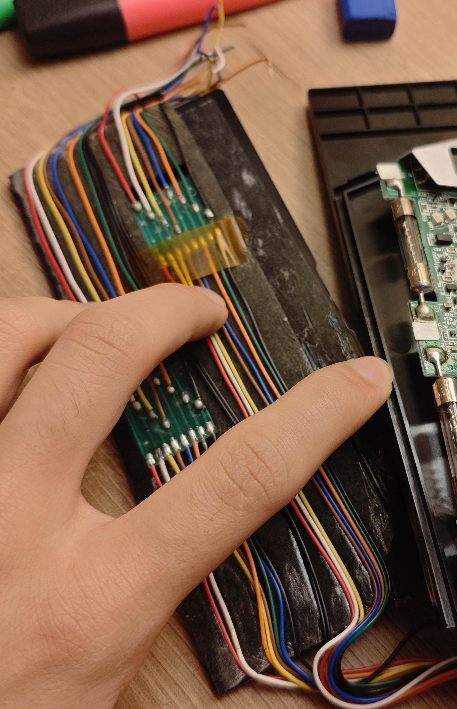
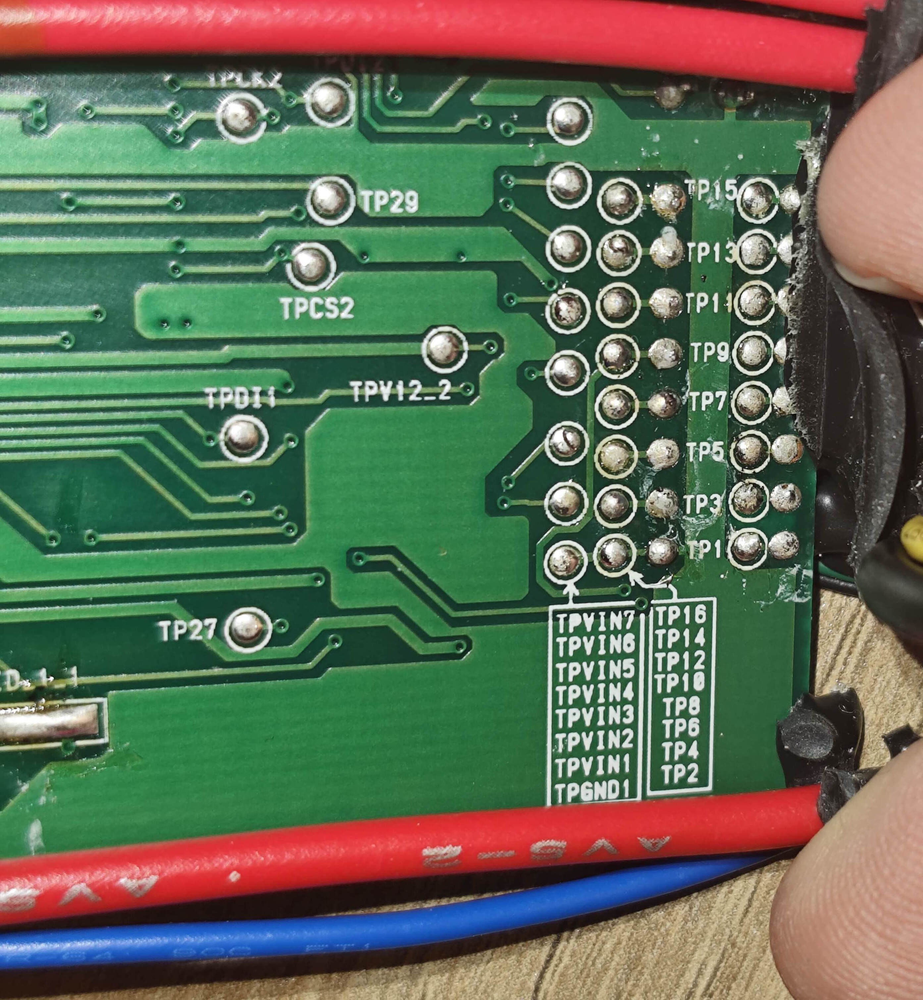
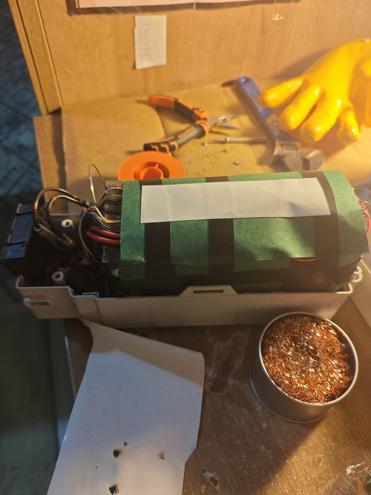

# Gazelle Easy Glider Custom Battery & BMS Rebuild Guide

This repository contains technical documentation and wiring insights for the **Gazelle Easy Glider (26V 250W Panasonic Mid-Drive)** e-bike battery rebuilding process. Since there is minimal technical documentation online for this specific model, this guide serves as a resource for engineers and DIY enthusiasts. 

## 1. Project Overview, Reasons and Tools
These Gazelle models were manufactured between 2005-2009. That means the old battery was 17-21 years old when I did this project in 2026.
According to my capacity test, the old battery pack had less than 50% of the original capacity. 
Old batteries were in a pouch sandwich form, which gets dangerous over time. 
I changed the old 7S2P pouch battery system to a 7S3P 21700 battery setup while protecting the original BMS card.

Tools and materials I used:
* 60W soldering iron & solder
* Electronic side cutter
* Fishpaper
* Electrical tape (to anchor fishpaper)
* Double-sided tape
* Pure copper strips
* 7x3 cell holders
* 21 pcs EVE 50E
* Multimeter
* Special torx screwdriver
* Phillips screwdriver

*(I didn't have a spot welder, so I attached the copper strips using solder, taking care not to heat up the batteries.)*

Overview of steps:
1) Opening and separating the outer case of the battery pack
2) Separating old batteries
3) Connecting the BMS and new battery pack together
4) Securing to avoid short-circuits and closing

---

### 1) Opening and separating outer case of battery pack
**Warning:** Make sure the battery is fully discharged to reduce the danger of short-circuits and thermal runaway.

   
The outer case has special screws with a gear-shaped hole and a little pin in the middle (Security Torx). First, you need to remove all 4 Torx screws.
You need to be careful in this step because the BMS board is screwed to the outer case from the inside. You need to pry the side clips of the outer case with a thin tool, then the outer case opens. 
You'll see 2 Phillips screws that hold the BMS and plastic board. Remove them, then take out the system from the outer case.

### 2) Separating old batteries
You need to peel the old battery block's outer layer. Make sure not to puncture the battery pack and try to avoid using sharp metal objects.
After reaching the 14-sandwich battery pouch, cut all 16 balance cables and 4 main cables. Make sure to isolate the + terminals and use the cutting tool carefully to avoid a short-circuit.
The 14-sandwich battery is designed as 7S2P, and the BMS board is manufactured to treat them as two separate, independent batteries. That's why there are 16 balance cables and 4 main cables.

*Since I was new to battery systems at the time, that architecture was new to me. Because there is nearly no guide/datasheet for this BMS, it was the hardest part for me to understand why there are 16 balance cables instead of 8.*

After cutting all the wires and separating the plastic board glued to the battery pack, you need to pull out a thermal sensor that is placed between the batteries.
There will also be a fuse glued to the batteries that pops at 99°C, securing the system on BMS failure. 
Fuse in question:

### 3) Connecting BMS and new battery pack together
**Warning:** The BMS might drop the output voltage to ~5V (with the battery level indicator still on) or completely cut power for both output and the LED indicator during short-circuits or arcs. It unlocks instantly after you connect it to the original charger. 

Because monitoring 2 parallel batteries independently is not really necessary and makes no sense when your new battery pack is different than the original 2-parallel setup, you can just solder balance cables with the same color together.

As you can see, the 16 balance wires are already arranged in groups of eight. The colors are not random. For example, both green cables are measuring 3.6V (1S), and brown ones are 14.4V (4S). This includes the main balance cables.
You should also solder the 2 main red cables and 2 main black cables together for the same reason.

The colors might be different for your BMS model. There are balance cables named on the back side of the BMS, TP1 to TP16. TP1 and TP2 are going to get soldered together in our architecture because TP1 is the main (-) balance for parallel one, and TP2 is the main (-) balance cable for parallel two. TP3-TP4 is 1S, TP5-TP6 is 2S, etc. so you should solder each couples together.

After soldering, you get 8 balance cables and 2 main cables like a normal 7S BMS has. So after that, it's just normal BMS connecting: TP1-TP2 cable is (B0), TP2-TP3 cable is (B1) etc.
You should also embed the thermal sensor and thermal fuse inside the new batteries for thermal security.

### 4) Securing to avoid short-circuits and closing
Secure the battery pack from short-circuits. I insulated the risky areas between the series groups with pieces of fishpaper. Then I put the plastic part back (which was inside the old battery) and added another fishpaper layer and electric tape to hold it. This helps to absorb shocks and makes the pack thick enough so it doesn't rattle inside the case.
   
Optionally, you can secure the cable manager plastic part to the pack and arrange the cables.

I used 21 pieces of 21700 because they fit almost perfectly into the old battery pack's volume. When you are sure the pack is not moving inside, you can assemble it back.
Screw the BMS in place, secure the plastic between the BMS and the battery pack, and tape between that plastic part and the battery pack.
Place the BMS output adapter (black plastic part) back in place, and close the outer case.

Before closing the outer case:

(I added two-sided tape to top of the pack to hold onto other part of outer case)
After screwing the 4 Torx screws back (watch out, make sure no cables are pinched under the screws) and making sure nothing rattles inside, your upgraded battery pack is ready.
